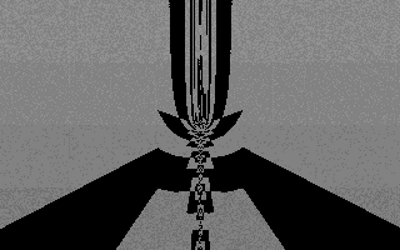

# brainlez Coders! : tubiform

A 256 byte DOS intro written by pestis / bC!, submitted to the Lovebyte
2022 256b intro competition. `tubiform.com` is the official COVOX
version submitted to the competition. `spkrtubi.com` is a fallback PC
speaker version, in case you don't have COVOX and still want to enjoy at
least some sound. Note that the DOSBox does not emulate the speaker that
well, but it sounds more reasonable on real machines.

Source code: https://github.com/vsariola/tubiform

Capture: https://www.youtube.com/watch?v=KDmdM0f4dqw

Tested to be working on DOSBox and FreeDOS, running on a modern laptop.
Based on DOSBox cycle estimates, I estimate it to be watchable on a 66
MHz 486, and indistinguishable from the capture on a ~ Pentium. However,
I don't have an oldschool DOS machine; if you do, please get in touch
and report how (if) it runs. Email address firstname.lastname@gmail.com
works, or pestis @ Sizecoding & Demoscene discords.

Massive love to everyone answering my clueless questions on the
sizecoding discord #x86 channel: superogue, HellMood, TomCat, baze,
Ped7g, byteobserver, ttg, DevEd/AYCE, Dresdenboy, Kuemmel, Harekiet,
unlord, DrClaw. Seriously guys, you are awesome! I tried my best to put
your generous advice into good use.

## Building

You need [nasm](https://nasm.us/). Then:

```
nasm tubiform.asm -fbin -o tubiform.com
nasm spkrtubi.asm -fbin -o spkrtubi.com
```

or just run the `build.bat`.

## Statistics

- Init & deinit: 45 bytes
- Visuals: 71 bytes
- Music player & sync / script engine: 85 bytes
- Song data: 39 bytes
- Script data: 16 bytes
- **Total: 256 bytes**

## Technical

- I started with the tracked music. The idea of the player routine is
  similar to the one I used in the TIC-80 intro
  [cracklebass](https://github.com/vsariola/cracklebass), but heavily
  simplified. There are three channels. Each channel is one octave
  apart, and plays notes at different speeds: bass channel is 2x faster
  than mid channel, which in turn is 2x faster than the treble channel.
  Each channel has it's own order list, which advances at the same time
  for all the channels. This means that, before the order list advances,
  the bass channel has repeated a pattern more times than the treble
  channel. This trick allows the bass and the treble play exactly the
  same pattern, but it does not quite sound the same, and the loop
  length is the treble channels loop length.
- Each note has a linearly decaying envelope and the waveform is a
  square wave. Instead of a square wave that has positive and negative
  amplitude, it goes between zero and positive value, so depending on
  the oscillator phase, we either add the channel envelope value to the
  total sample value or we don't.
- For each pattern, the order list contains two nibbles: one for chord,
  and one for index in the pattern table. All note frequencies in the
  pattern are multiplied by the chord nibble. The I-IV-V chord
  progression was not done because I particularly like it, but because
  they have ratios that can represented with integers that fit a nibble:
  I = 6, IV = 8 and V = 9. This gives the classic
  [Pythagorean tuning](https://en.wikipedia.org/wiki/Pythagorean_tuning)
  4/3 ratios for the fourths and 3/2 ratios for the fifths.
- Similarly, the pattern notes are stored with integer frequency values,
  with the ratios chosen according to the Pythagorean tuning. The
  patterns were packed so that they slightly overlap: the last note of
  one pattern is the first note of another pattern. The patterns are
  stored backwards, because running time backwards was an easier way to
  make linearly decaying envelopes, instead of linearly attacking
  envelopes.
- The envelopes of the three channels are stored and added to a few
  places, to make visuals sync to music.
- There is also a "script": when the order list advances, the script
  contains two bytes: one byte indicating the address of the byte to
  change, and another byte indicating the new value. Mostly, this script
  is used to mutate the code for the visuals. In particular, we mutate
  the x87 FPU instructions, which are two bytes long. Typically, the
  first byte is D9 and we change the second byte. Basically, all the
  visuals are some glitched out variation of the classic tunnel effect.
  The visuals were prototyped with Shadertoy, where I tested what would
  happen if I replace tan with sin etc. Some of the variations totally
  mess up FPU stack: some of the instructions just modify st0, while
  others push new values on the stack. We don't care if the FPU stack
  overflows regularly as long as it gives nice visuals.
- We also change where one particular constant is pulled in the visuals.
  In the beginning, it points to a location with static data, but after
  the first pattern, we change it to point to the location containing
  the time counter, so the visuals start to move with time.
- We also use the script to change how much is added to the pixel color,
  to make the intro go from black and white to a more colorful variation
  in the last moments of the intro.
- The last thing the script does is to mutate the exit condition:
  instead of the classic esc check
```
in al,60h
dec ax
jnz main
```
we mutate the jnz label target to point to the dec ax i.e.
```
in al,60h
decrease:
dec ax
jnz decrease
```
So ax immediately loops to 0 regardless of the button pressed, and the
intro exits. As an added bonus, in both situations (esc pressed or song
ends), we can now be sure that ax is 0.
- The music player is hooked to the interrupt 08h. Using interrupt 1Ch
  could save us from issuing End-of-Interrupt ourselves. However, this
  would mean that also the native DOS 08h interrupt gets called at a
  very high rate, so the system time would run forward a lot. Hooking to
  08h meant that the system time of day only only misses the time the
  intro is running.
- Overall, I tried to make the exit as clean as possible: restore the
  original interrupt handler and return back to text mode. This is
  regardless of how the intro ends: if the song ends or if the user
  presses ESC. I was told you get extra cool points for clean exits.

License: [MIT](LICENSE)

